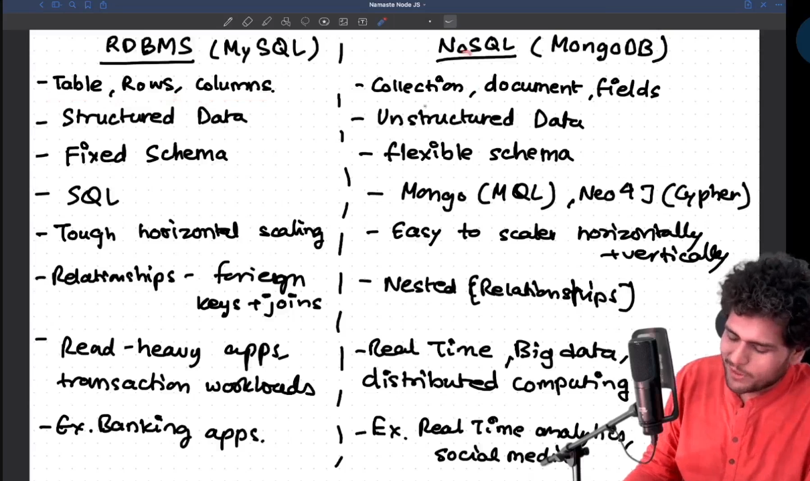

Databases SQL vs NoSQL

Database is a organized/structured collection of data.

DBMS - is a software that interacts with end users and database

Types of Databases
1. Relational DB - MySQL, PostgresSQL
2. NoSQL DB - MongoDB
3. In memory DB - Redis (its used as cahce)
4. Distributed SQL DB - Cockroach DB
5. Time series DB - Influx DB
6. OO DB - db4o
7. Graph DB - Neo4j
8. Hierarchial DB - IBM IMS
9. Network DB - 10MS
10. Cloud DB - Amazon RDS

Top 2 are the most used in companies  

RDBMS (MySQL, PostgressSQL)
MySQL is managed by oracle
SQL - structured query language

NoSQL (MongoDB)
* Document DB
* keyvalue DB
* Graph DB
* wide column DB
* Multimodel DB

Mongo DB is a Document DB

Mongo DB is 
- flexible
- compatible with js stack
- devolper friendly
- increases dev productivity
- document <-> json

RDBMS vs NoSQL (Document)

in NoSQL we don't require joins, data normalization

in NoSQL instead of tables we call collection

Uber uses schema less database 
